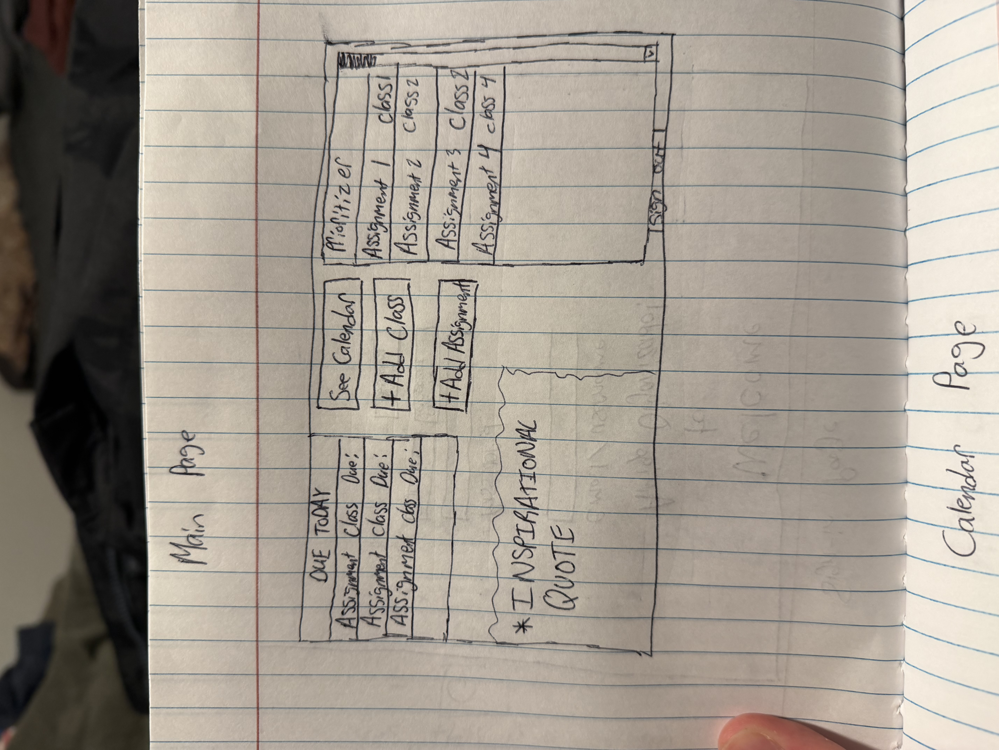
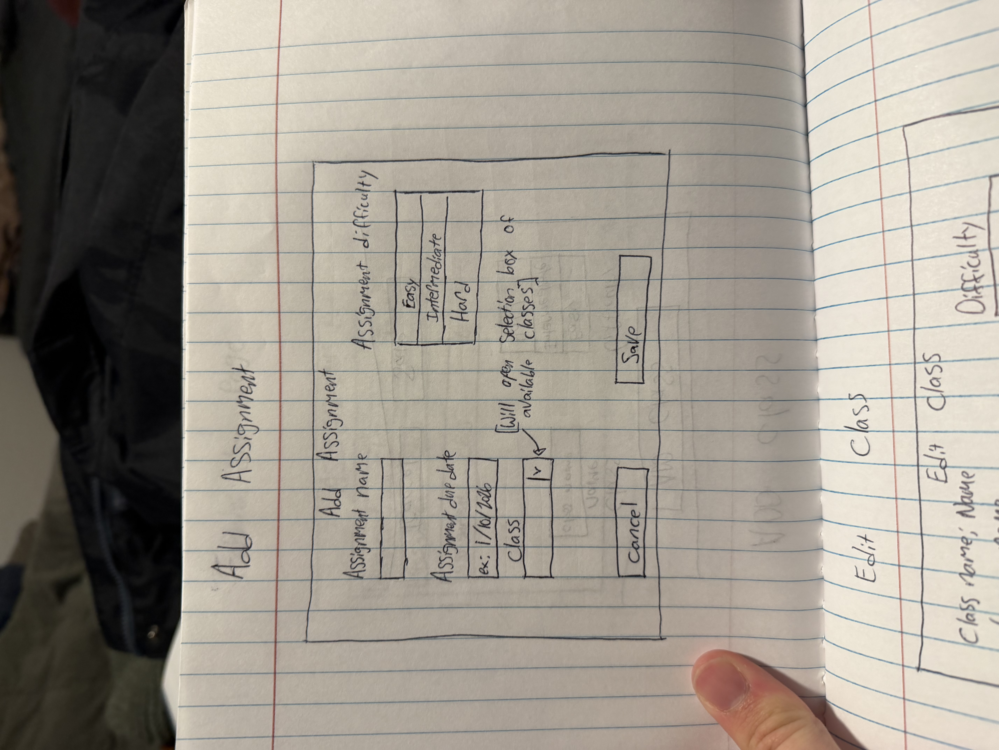
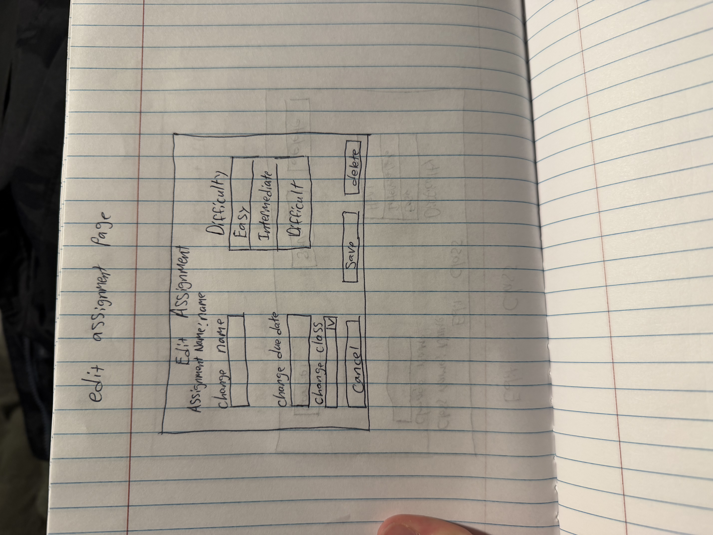

# AmigoOrganizado

[My Notes](notes.md)

AmigoOrganizado is a web application intended for helping college students to organize their work! By signing up and giving a little bit of information about each class that a student is taking (name of the class and difficulty) and each assignment that is due (ranked by difficulty), AmigoOrganizado will help students prioritize their work!  Some of the functionality includes a prioritizer (which assignemnts should be completed first based on class difficulty, assignment difficulty and due date), an "emergency window" which says all assignments that are due today, as well as a kind of anonymous "leaderboard" which currently states which student is having the most amount of coursework to complete

> [!NOTE]
> This is a template for your startup application. You must modify this `README.md` file for each phase of your development. You only need to fill in the section for each deliverable when that deliverable is submitted in Canvas. Without completing the section for a deliverable, the TA will not know what to look for when grading your submission. Feel free to add additional information to each deliverable description, but make sure you at least have the list of rubric items and a description of what you did for each item.

> [!NOTE]
> If you are not familiar with Markdown then you should review the [documentation](https://docs.github.com/en/get-started/writing-on-github/getting-started-with-writing-and-formatting-on-github/basic-writing-and-formatting-syntax) before continuing.

## 🚀 Specification Deliverable

> [!NOTE]
> Fill in this sections as the submission artifact for this deliverable. You can refer to this [example](https://github.com/webprogramming260/startup-example/blob/main/README.md) for inspiration.

For this deliverable I did the following. I checked the box `[x]` and added a description for things I completed.

- [x] Proper use of Markdown
    -  I read through the Markdown document and confirmed that I used markdown correctly
- [x] A concise and compelling elevator pitch
    - I added a concise and compelling elevator pitch
- [x] Description of key features
    - I added a description of key features as asked
- [x] Description of how you will use each technology
    - I read through the basic function of each technology and wrote how I think I will use each one
- [x] One or more rough sketches of your application. Images must be embedded in this file using Markdown image references.
    - I embedded the images

### Elevator pitch

Have you ever had a hard time organizing your coursework? AmigoOrganizado is here to help you thrive in all of your classes! Just by providing simple information about your classes and coursework, AmigoOrganizado will prioritize which assignments should be completed first, show you which assignments are due today and show you a calendar with all of your assignments.

### Design

### Key features

- Courswork prioritizer--a window on the main page showing the order in which you should complete your assignments
- Due Today Window--a window on the main page showing which assignments are due today
- Calendar--shows which assignments are due for each day in a given month.

### Technologies

I am going to use the required technologies in the following ways.

- **HTML** - I will use HTML to organize and structre my web page and the elements / contents on it
- **CSS** - I will use CSS to add page animations, create a more dynamic experience and style the web page
- **React** - I will use React to make my web application "alive"--add reactive components that change based on user input and data changes
- **Service** - I will use web services to provide a connection between the frontend and backend of my web application
- **DB/Login** - I will use a database to store specific user information to be used within the web application and enable login for a use to retrieve/manipulate said data from the Database
- **WebSocket** - I will use Websocket to create a peer to peer connection with the server of AmigoOrganizado so that data can be efficiently sent and updated on both ends at any time

## 🚀 AWS deliverable

For this deliverable I did the following. I checked the box `[x]` and added a description for things I completed.

- [x] **Server deployed and accessible with custom domain name** - [My server link](https://amigoorganizado.click/).
    I rented the domain amigoorganizado.click, setup the server, and edited the Caddy file.

## 🚀 HTML deliverable

For this deliverable I did the following. I checked the box `[x]` and added a description for things I completed.

- [X] **HTML pages** - Created basic HTML structure for my web page
- [X] **Proper HTML element usage** - Used basic HTML elements and element containers to create code that is easy to read
- [X] **Links** - used hyperlinks where appropriate to simulate editing classes and assignments.
- [X] **Text** - Added text and comments where needed to readability
- [X] **3rd party API placeholder** - Added placeholder inspirational quote and calendar for the APIs.
- [X] **Images** - Added images where needed as reference.
- [X] **Login placeholder** - Created simple login page
- [X] **DB data placeholder** - I completed this part of the deliverable.
- [X] **WebSocket placeholder** - I will use WebSocket to update table data and with communication with the Google Calendar and Inspirational Quotes APIs.

## 🚀 CSS deliverable

For this deliverable I did the following. I checked the box `[x]` and added a description for things I completed.

- [ ] **Visually appealing colors and layout. No overflowing elements.** - I did not complete this part of the deliverable.
- [ ] **Use of a CSS framework** - I did not complete this part of the deliverable.
- [ ] **All visual elements styled using CSS** - I did not complete this part of the deliverable.
- [ ] **Responsive to window resizing using flexbox and/or grid display** - I did not complete this part of the deliverable.
- [ ] **Use of a imported font** - I did not complete this part of the deliverable.
- [ ] **Use of different types of selectors including element, class, ID, and pseudo selectors** - I did not complete this part of the deliverable.

## 🚀 React part 1: Routing deliverable

For this deliverable I did the following. I checked the box `[x]` and added a description for things I completed.

- [ ] **Bundled using Vite** - I did not complete this part of the deliverable.
- [ ] **Components** - I did not complete this part of the deliverable.
- [ ] **Router** - I did not complete this part of the deliverable.

## 🚀 React part 2: Reactivity deliverable

For this deliverable I did the following. I checked the box `[x]` and added a description for things I completed.

- [ ] **All functionality implemented or mocked out** - I did not complete this part of the deliverable.
- [ ] **Hooks** - I did not complete this part of the deliverable.

## 🚀 Service deliverable

For this deliverable I did the following. I checked the box `[x]` and added a description for things I completed.

- [ ] **Node.js/Express HTTP service** - I did not complete this part of the deliverable.
- [ ] **Static middleware for frontend** - I did not complete this part of the deliverable.
- [ ] **Calls to third party endpoints** - I did not complete this part of the deliverable.
- [ ] **Backend service endpoints** - I did not complete this part of the deliverable.
- [ ] **Frontend calls service endpoints** - I did not complete this part of the deliverable.
- [ ] **Supports registration, login, logout, and restricted endpoint** - I did not complete this part of the deliverable.

## 🚀 DB deliverable

For this deliverable I did the following. I checked the box `[x]` and added a description for things I completed.

- [ ] **Stores data in MongoDB** - I did not complete this part of the deliverable.
- [ ] **Stores credentials in MongoDB** - I did not complete this part of the deliverable.

## 🚀 WebSocket deliverable

For this deliverable I did the following. I checked the box `[x]` and added a description for things I completed.

- [ ] **Backend listens for WebSocket connection** - I did not complete this part of the deliverable.
- [ ] **Frontend makes WebSocket connection** - I did not complete this part of the deliverable.
- [ ] **Data sent over WebSocket connection** - I did not complete this part of the deliverable.
- [ ] **WebSocket data displayed** - I did not complete this part of the deliverable.
- [ ] **Application is fully functional** - I did not complete this part of the deliverable.
